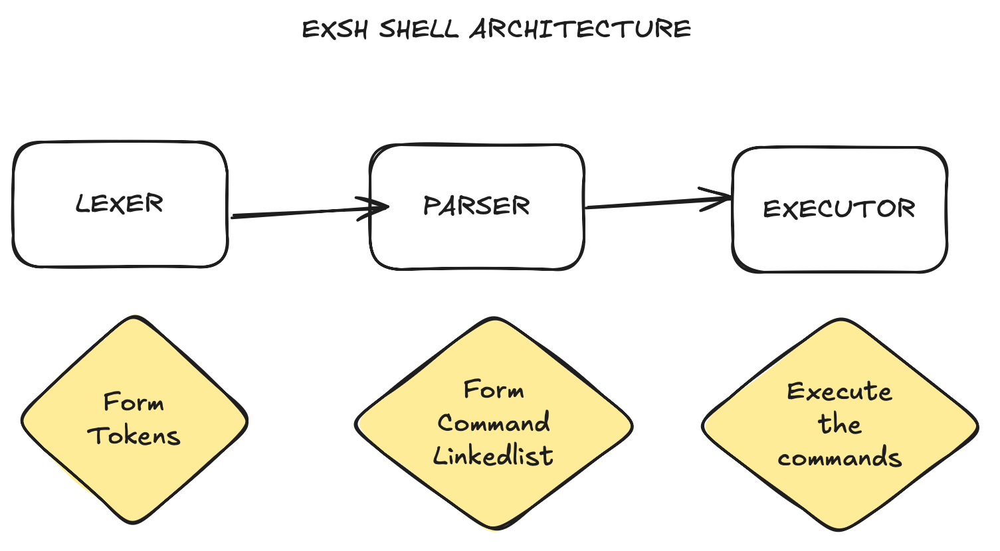

# **Exsh — A Custom Unix Shell in C**


---


Welcome to **Exsh**, a lightweight educational shell written in pure C. This project mimics the core behavior of Unix shells — covering command parsing, pipes, input/output redirection, process creation with `fork()`, and execution using `execvp()`.

🔬 Designed for learning, OS-level process management, and understanding how real shells like Bash work.


## 🌟 Features

| Shell Feature                 | Exsh Implementation                                  |
|-------------------------------|-----------------------------------------------------|
| Interactive Prompt            | `$` prompt for user input                           |
| Command Execution             | Runs system commands with arguments                 |
| Pipes (`|`)                   | Connects output of one command to input of another |
| Input/Output Redirection (`>`, `>>`, `<`) | Redirects stdin/stdout to files           |
| Built-in Commands             | `cd`, `exit`                                        |
| Process Management            | `fork()`, `execvp()`, `wait()` for process control |

## 🚀 Getting Started

## 🔧 Build

```bash
cd exsh/src
make
./exsh
```
## 📚 Usage Examples
```
$ ls -l
$ cd folder
$ ls | grep txt > out.txt
$ exit
```

## Exsh Architecture




## Readmore here: [Exsh Blog](https://medium.com/@meerthika/building-a-shell-in-c-understanding-fork-pipes-and-file-descriptors-fc030ca7549d)

## 🤝 Contributing

We ❤️ contributors!

To contribute:

1. Fork the repository.
2. Clone it locally:
   ```bash
   git clone [repo]
   cd exsh/src
   git checkout -b feature/my-improvement
   ```
## License
@Meerthika


